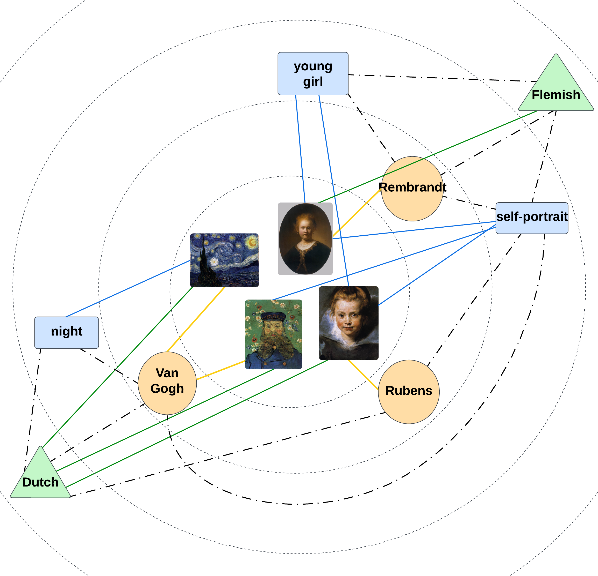
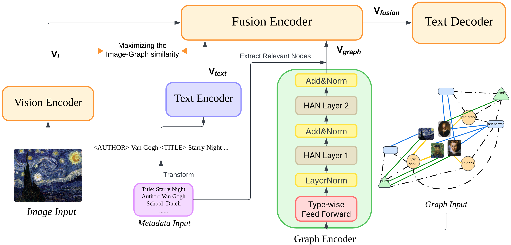

# KALE: An Artwork Image Captioning System Augmented with Heterogeneous Graph

## Introduction
Exploring the narratives conveyed by fine-art paintings is a challenge in image captioning, where the goal is to generate descriptions that not only precisely represent the visual content but also offer a in-depth interpretation of the artwork's meaning. The task is particularly complex for artwork images due to their diverse interpretations and varied aesthetic principles across different artistic schools and styles. In response to this, we present KALE (Knowledge-Augmented vision-Language model for artwork Elaborations), a novel approach that enhances existing vision-language models by integrating artwork metadata as additional knowledge. KALE incorporates the metadata in two ways: firstly as direct textual input, and secondly through a multimodal heterogeneous knowledge graph. To optimize the learning of graph representations, we introduce a new cross-modal alignment loss that maximizes the similarity between the image and its corresponding metadata. Experimental results demonstrate that KALE achieves strong performance over existing state-of-the-art work across several artwork datasets, particularly in achieving impressive CIDEr scores.

 
 


## Setup


### Requirements
* [PyTorch](https://pytorch.org/) version == 1.11.0
* numpy == 1.23.5
* python == 3.9.16
* pytorch == 1.11.0
* ruamel-yaml == 0.17.21
* torchvision == 0.12.0
* wandb

### Prepare Data
1. Download pre-trained vision transformer [vit-l-14](https://alice-open.oss-cn-zhangjiakou.aliyuncs.com/mPLUG/ViT-L-14.tar). (Do not UNZIP it!!)
2. Download dataset and unzip it to the main directory [data.zip]().
3. Download language evaluation tool and unzip it to the main directory [language_evaluation.zip](https://alice-open.oss-cn-zhangjiakou.aliyuncs.com/mPLUG/language_evaluation.tar).
4. Download bert_base_uncased and unzip it to the main directory [bert_base_uncased.zip]().
5. Download training and evaluation checkpoints and unzip it to the main directory [checkpoint.pth]().

### Training from the start
For Artpedia and SemArt (Visual/Contextual Split) datasets:

1. KALE: Run ```python KALE.py```
2. KALE<sub>text</sub>: Run ```python KALE_text.py```
3. KALE<sub>text+KG</sub>: Run ```python KALE_text_KG.py```

Remember to change the output directory and dataset name for different datasets.

For SemArt (Form/Content/Context Split) datasets:

1. KALE: Run ```python KALE_three_split.py```
2. KALE<sub>text</sub>: Run ```python KALE_text_three_split.py```
3. KALE<sub>text+KG</sub>: Run ```python KALE_text_KG_three_split.py```

Remember to change the output directory and dataset name for different datasets.

### Evaluation on test set using provided checkpoints (Reproduce the results)
For Artpedia and SemArt (Visual/Contextual Split) datasets:

1. KALE: Run ```python test_set_evaluate.py```

2. KALE<sub>text</sub>: Run ```python test_set_evaluate_text.py```

3. KALE<sub>text+KG</sub>: Run ```python test_set_evaluate_kg.py```

Remember to change the output directory and dataset name for different datasets.

For SemArt (Form/Content/Context Split) datasets:

1. KALE: Run ```python test_set_evaluate_three_split.py```

2. KALE<sub>text</sub>: Run ```python test_set_evaluate_three_split_text.py```

3. KALE<sub>text+KG</sub>: Run ```python test_set_evaluate_three_split_kg.py```

Remember to change the output directory and dataset name for different datasets


## Generated Examples


## Acknowledgement
This research was supported by The University of Melbourne’s Research Computing Services and the Petascale Campus Initiative.


