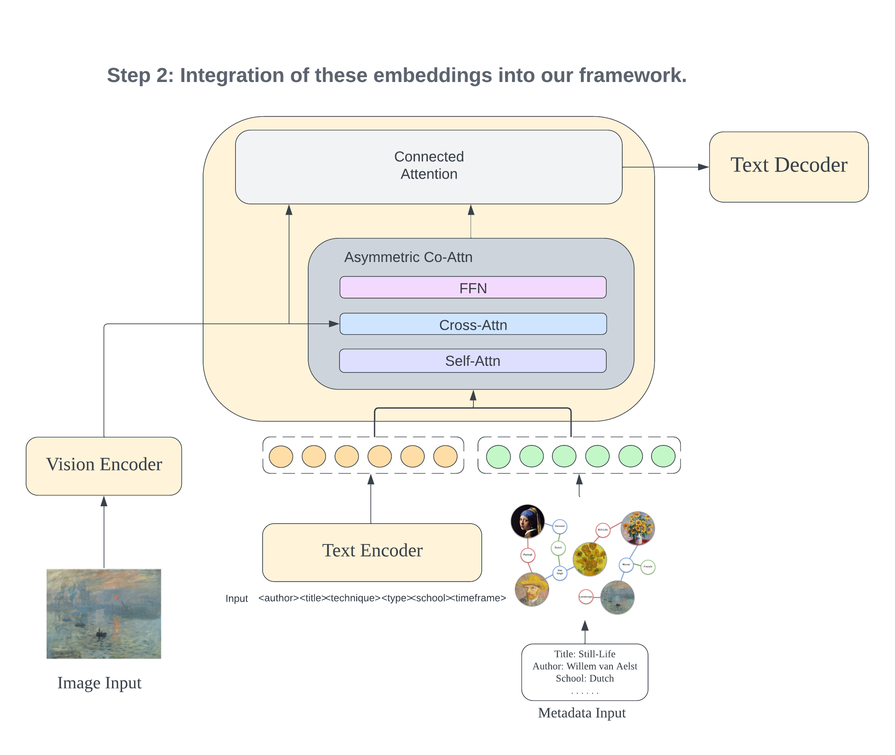

# Artwork-Interpretation
Repository for MCS Research Project 
[vit-l-14](https://drive.google.com/file/d/1d14j4Lui-VnkFKwkd2YCEbvl2c9Ig5je/view)
# KALE: Knowledge-Augmented vision-Language model for artwork Elaborations.


## Introduction
In this work, we present our novel approach, KALE, a shorthand for Knowledge-Augmented vision-Language model for artwork Elaborations. In general, our model adapts an existing pre-trained vision-language model to the art domain and incorporates artwork metadata into the model through two ways: 1) as textual input, 2) through the inclusion of knowledge graph embeddings. For the first variant of the model, KALE, we use only the artwork image as input. In our second approach, KALE<sub>text</sub>, we consider using artwork metadata as the textual input. In the third variant of the model, KALE<sub>text+KG</sub>, we maintain the use of metadata as textual input while also incorporating knowledge graph embeddings into the framework.

 
 


## Setup


### Requirements
* [PyTorch](https://pytorch.org/) version == 1.11.0
* numpy == 1.23.5
* python == 3.9.16
* pytorch == 1.11.0
* ruamel-yaml == 0.17.21
* torchvision == 0.12.0
* wandb

### Prepare Data
1. Download pre-trained vision transformer [vit-l-14](https://drive.google.com/file/d/1d14j4Lui-VnkFKwkd2YCEbvl2c9Ig5je/view). (Do not UNZIP it!!)
2. Download dataset and unzip it to the main directory [data.zip](https://drive.google.com/file/d/1d14j4Lui-VnkFKwkd2YCEbvl2c9Ig5je/view).
3. Download language evaluation tool and unzip it to the main directory [language_evaluation.zip](https://drive.google.com/file/d/1d14j4Lui-VnkFKwkd2YCEbvl2c9Ig5je/view).
4. Download bert_base_uncased and unzip it to the main directory [bert_base_uncased.zip](https://drive.google.com/file/d/1d14j4Lui-VnkFKwkd2YCEbvl2c9Ig5je/view).
5. Download training and evaluation checkpoints and unzip it to the main directory [language_evaluation.zip](https://drive.google.com/file/d/1d14j4Lui-VnkFKwkd2YCEbvl2c9Ig5je/view).

### Training from the start
For Artpedia and SemArt (Visual/Contextual Split) datasets:

1. KALE: Run ```python KALE.py```
2. KALE<sub>text</sub>: Run ```python KALE_text.py```
3. KALE<sub>text+KG</sub>: Run ```python KALE_text_KG.py```

Remember to change the output directory and dataset name for different datasets.

For SemArt (Form/Content/Context Split) datasets:

1. KALE: Run ```python KALE_three_split.py```
2. KALE<sub>text</sub>: Run ```python KALE_text_three_split.py```
3. KALE<sub>text+KG</sub>: Run ```python KALE_text_KG_three_split.py```

Remember to change the output directory and dataset name for different datasets.

### Evaluation on test set using provided checkpoints (Reproduce the results)
For Artpedia and SemArt (Visual/Contextual Split) datasets:

1. KALE: Run ```python test_set_evaluate.py```

2. KALE<sub>text</sub>: Run ```python test_set_evaluate_text.py```

3. KALE<sub>text+KG</sub>: Run ```python test_set_evaluate_kg.py```

Remember to change the output directory and dataset name for different datasets.

For SemArt (Form/Content/Context Split) datasets:

1. KALE: Run ```python test_set_evaluate_three_split.py```

2. KALE<sub>text</sub>: Run ```python test_set_evaluate_three_split_text.py```

3. KALE<sub>text+KG</sub>: Run ```python test_set_evaluate_three_split_kg.py```

Remember to change the output directory and dataset name for different datasets

### 
## Acknowledgement

This research was supported by The University of Melbourne’s Research Computing Services and the Petascale Campus Initiative.


